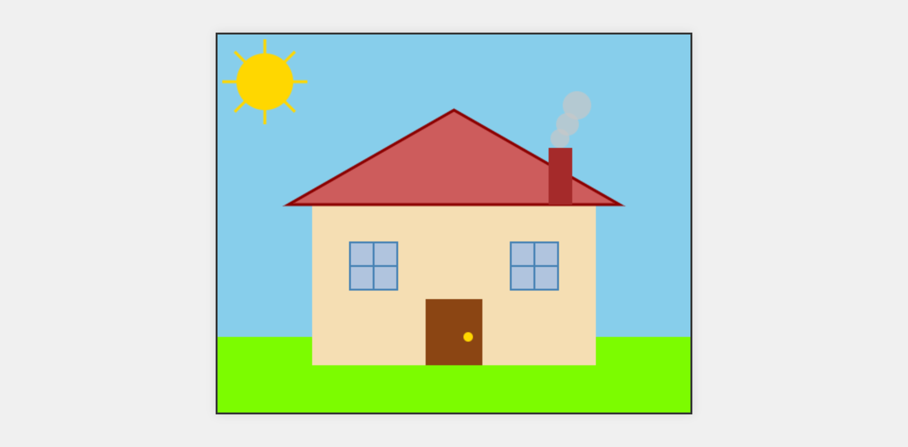

# Simple house website using HTML5

## Information
[NTI X Hub AI] Hub GenAI for Future Founders: Week 1 - Exercise 1.1

Name: **Hoang Tran Nhat Minh**

GitHub repository: https://github.com/htnminh/simple-house-website

## Preview
Captured with [GoFullPage - Full Page Screen Capture](https://chromewebstore.google.com/detail/gofullpage-full-page-scre/fdpohaocaechififmbbbbbknoalclacl).



## Prompts
Cursor (Agent mode) with Claude 3.7 Sonnet.

```
follow this instruction:
"""
Exercise: Draw a Simple House on HTML5 Canvas
----
Objective:
----
Apply knowledge of HTML5 Canvas to draw basic shapes.
Use the fillRect(), beginPath(), moveTo(), lineTo(), and closePath() methods to draw different shapes.
Use the fillStyle and strokeStyle properties to create colors and outlines for the drawing.
----
Requirements:

1. Conceptualize and design (25%):
Sketch the image of the house you want to draw. Determine the location, size, and color of the components (body, roof, windows, doors, ...).
Plan which shapes and drawing methods to use to create each component.

2. Write HTML code (25%):
Create a new HTML file (index.html) with the basic HTML structure.
Add a <canvas> element inside the <body> with the id "myCanvas", width 500px and height 400px.
Add a <script> tag to link to your JavaScript file.

3. Write CSS (25%):
Create a style.css file and add CSS to create a border for the canvas.

4. Write JavaScript (20%):
Create a separate JavaScript file (script.js).
- Draw the body of the house:
Use fillStyle to choose a color for the body of the house (e.g. "lightgray").
Use fillRect() to draw a rectangle for the body of the house at the appropriate position and size (e.g. ctx.fillRect(100, 200, 300, 200);).
- Draw the roof:
Use beginPath() to start a new path.
Use moveTo() to move the starting point to the top of the roof (e.g. ctx.moveTo(100, 200);).
Use lineTo() to draw the lines that make up the roof (e.g. ctx.lineTo(250, 100);, ctx.lineTo(400, 200);, ctx.lineTo(100, 200);).
Use closePath() to close the path.
Use fillStyle to choose a color for the roof (e.g. "red").
Use fill() to color the roof.
- Drawing windows and doors:
Use fillStyle to choose a color for the windows (e.g. "lightblue").
Use fillRect() to draw one or more windows on the body of the house.
Use fillStyle to choose a color for the doors (e.g. "brown").
Use fillRect() to draw the doors.
- Add details (advanced):
Use strokeStyle and lineWidth to add outlines to the shapes.
Add other details like chimneys, fences, or trees.
Use other shapes like circles or curves to make the house more dynamic.
"""
```